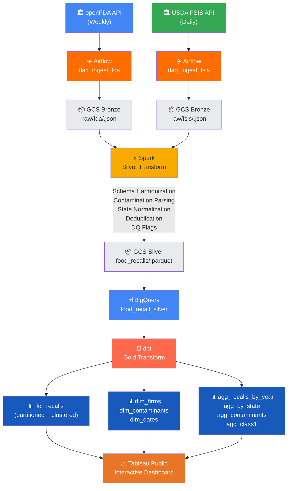

# U.S. Food Recall Analytics Pipeline

An end-to-end data engineering pipeline that ingests, transforms, and visualizes food recall data from two federal agencies — the **FDA** and **USDA FSIS** — covering the entire U.S. food supply from 2004 to present.

---

## Problem Statement

Each year, hundreds of food products are recalled in the United States due to contamination, mislabeling, and undeclared allergens. These recalls are tracked by two separate federal agencies:

- **FDA** — regulates ~80% of the food supply (produce, seafood, dairy, packaged foods, beverages)
- **USDA FSIS** — regulates ~20% (meat, poultry, processed eggs)

This project unifies data from both agencies into a single analytical platform to answer:

- How have food recalls trended over time (2004–present)? Are they increasing?
- Which recall classifications (Class I = most dangerous) are growing?
- What are the most common contaminants (Salmonella, Listeria, E. coli, undeclared allergens, foreign objects)?
- Which contaminants are growing fastest?
- Which states have the most recalling firms?
- How do FDA vs. FSIS recalls compare?

---

## Architecture

```text
┌──────────────┐    ┌──────────────┐
│  openFDA API │    │ USDA FSIS API│
│  (weekly)    │    │  (daily)     │
└──────┬───────┘    └──────┬───────┘
       │                   │
       ▼                   ▼
┌──────────────────────────────────┐
│         AIRFLOW (Orchestration)  │
│  dag_ingest_fda  │ dag_ingest_   │
│                  │ fsis          │
└────────┬─────────┴──────┬────────┘
         │                │
         ▼                ▼
┌──────────────────────────────────┐
│       GCS BRONZE LAYER           │
│  raw/fda/year=.../data.json      │
│  raw/fsis/year=.../data.json     │
└────────────────┬─────────────────┘
                 │
                 ▼
┌──────────────────────────────────┐
│       SPARK (Silver Transform)   │
│  Schema harmonization            │
│  Contamination parsing (regex)   │
│  State normalization             │
│  Deduplication                   │
│  Data quality flags              │
└────────────────┬─────────────────┘
                 │
                 ▼
┌──────────────────────────────────┐
│       GCS SILVER LAYER           │
│  silver/food_recalls/.parquet    │
└────────────────┬─────────────────┘
                 │
                 ▼
┌──────────────────────────────────┐
│       BIGQUERY                   │
│  food_recall_silver (raw table)  │
│                                  │
│       dbt (Gold Transform)       │
│  food_recall_gold:               │
│    ├── fct_recalls (partitioned) │
│    ├── dim_firms                 │
│    ├── dim_contaminants          │
│    ├── dim_dates                 │
│    ├── agg_recalls_by_year       │
│    ├── agg_recalls_by_state      │
│    ├── agg_contaminants_by_year  │
│    └── agg_class1_by_contaminant │
└────────────────┬─────────────────┘
                 │
                 ▼
┌──────────────────────────────────┐
│       TABLEAU PUBLIC             │
│  Interactive dashboard           │
└──────────────────────────────────┘
```

---

## Tech Stack

| Component | Technology | Purpose |
|---|---|---|
| Cloud | Google Cloud Platform (GCP) | Hosting infrastructure |
| Data Lake | Google Cloud Storage (GCS) | Bronze and Silver layers |
| Data Warehouse | BigQuery | Silver and Gold layers |
| Workflow Orchestration | Apache Airflow | Scheduling, dependency management, monitoring |
| Batch Processing | Apache Spark (PySpark) | Schema harmonization, contamination parsing, dedup |
| Transformation | dbt (data build tool) | Business-level models, tests, documentation |
| Data Ingestion | dlt (data load tool) + curl_cffi | API extraction with pagination handling |
| Visualization | Tableau Public | Interactive dashboard |
| Containerization | Docker + Docker Compose | Reproducible environment |
| Language | Python, SQL | Pipeline logic, transformations |
---

## Project Structure

```text
food-recall/
├── docker-compose.yml              # Airflow stack
├── Dockerfile                      # Dev container (Spark + Python)
├── requirements.txt                # Dev Python dependencies
├── .env                            # Environment variables
│
├── airflow/
│   ├── Dockerfile                  # Airflow image with Spark + dbt
│   ├── requirements.txt            # Airflow Python dependencies
│   └── dags/
│       ├── dag_ingest_fda.py       # Weekly FDA extraction → GCS
│       ├── dag_ingest_fsis.py      # Daily FSIS extraction → GCS
│       └── dag_transform_and_load.py # Spark → BigQuery → dbt
│
├── src/
│   ├── extractors/
│   │   ├── fda_extractor.py        # openFDA API with Search-After pagination
│   │   └── fsis_extractor.py       # FSIS API with curl_cffi browser impersonation
│   ├── uploaders/
│   │   └── gcs_uploader.py         # Upload NDJSON to GCS with date partitioning
│   ├── validators/
│   │   └── bronze_validators.py    # Data quality checks
│   └── notifications/
│       └── slack_notifier.py       # Alerting
│
├── spark/
│   └── silver_transform.py         # PySpark: harmonize, parse, deduplicate
│
├── dbt_food_recall/
│   ├── dbt_project.yml
│   ├── profiles.yml
│   ├── packages.yml
│   └── models/
│       ├── staging/
│       │   ├── stg_food_recalls.sql
│       │   └── stg_food_recalls.yml
│       └── marts/
│           ├── fct_recalls.sql
│           ├── dim_firms.sql
│           ├── dim_contaminants.sql
│           ├── dim_dates.sql
│           ├── agg_recalls_by_year.sql
│           ├── agg_recalls_by_state.sql
│           ├── agg_contaminants_by_year.sql
│           ├── agg_class1_by_contaminant.sql
│           └── marts.yml
│
├── config/
│   ├── settings.py                 # Central configuration
│   └── gcp/
│       └── service-account.json    # GCP credentials (gitignored)
│
└── tests/
```

---

## Data Sources

### openFDA Food Enforcement API

- **Endpoint:** `https://api.fda.gov/food/enforcement.json`
- **Coverage:** 2004–present, ~30k+ records
- **Update frequency:** Weekly
- **Pagination:** Search-After via `Link` HTTP header (required because skip/limit caps at 26,000 results)
- **Docs:** https://open.fda.gov/apis/food/enforcement/

### USDA FSIS Recall API

- **Endpoint:** `https://www.fsis.usda.gov/fsis/api/recall/v/1`
- **Coverage:** Recalls and public health alerts for meat, poultry, and egg products
- **Update frequency:** Real-time
- **Note:** The FSIS API blocks standard HTTP clients (returns 403). This pipeline uses `curl_cffi` with browser impersonation to bypass this protection.
- **Docs:** https://www.fsis.usda.gov/science-data/developer-resources/recall-api

---

## Data Pipeline



## Medallion Architecture (Bronze → Silver → Gold)

### Bronze (Raw Ingestion)

- **Location:** `gs://food-recall-bronze/raw/{api_name}/year=YYYY/month=MM/day=DD/data.json`
- **Format:** Newline-delimited JSON (NDJSON)
- **Contents:** Raw API responses, exactly as received
- **Retention:** Full history, partitioned by ingest date

### Silver (Cleaned + Enriched)

- **Location:** `gs://food-recall-silver/silver/food_recalls/year=YYYY/month=MM/day=DD/`
- **Format:** Parquet
- **Processing (Spark):**
  - Schema harmonization — FDA and FSIS have completely different field names and structures; both are mapped to a unified schema
  - Contamination parsing — regex-based extraction of 12 contamination categories from free-text `reason_for_recall` field
  - State normalization — full state names mapped to 2-letter abbreviations
  - Deduplication — window function to keep latest record per `recall_id`
  - Data quality flags — boolean columns flagging missing state, reason, classification, or date

### Gold (Business Models)

- **Location:** BigQuery `food_recall_gold` dataset
- **Processing (dbt):**
  - `fct_recalls` — central fact table, partitioned by `recall_date` (month), clustered by `classification` and `state`
  - `dim_firms` — one row per company + state, with recall counts
  - `dim_contaminants` — contamination categories with groupings (Biological, Allergen, Physical, Labeling)
  - `dim_dates` — calendar dimension
  - `agg_*` — pre-aggregated tables for dashboard performance

---

## Partitioning and Clustering Strategy

The `fct_recalls` table in BigQuery is:

**Partitioned by** `recall_date` (monthly granularity)

- The most common analytical queries are time-series trends ("recalls by year", "contaminant growth over time"). Monthly partitioning allows BigQuery to scan only the relevant date range, reducing cost and improving performance.

**Clustered by** `classification`, `state`

- These are the most frequent filter and GROUP BY columns. "Class I recalls in California" or "all recalls by classification" are typical queries. Clustering on these columns means BigQuery can skip irrelevant data blocks within each partition.

---

## Data Quality

### Spark Silver Layer

Data quality flag columns are added (not dropped) for transparency:

- `dq_missing_state` — 549 records (~1.8%)
- `dq_missing_reason` — 15 records (<0.1%)
- `dq_missing_classification` — 0
- `dq_missing_recall_date` — 0

### dbt Tests (12 tests, all passing)

- `recall_id` — unique, not null
- `classification` — accepted values: Class I, Class II, Class III, Public Health Alert, Not Yet Classified
- `recall_date` — not null
- `source_agency` — accepted values: FDA, FSIS
- `firm_id` — unique, not null
- `contamination_category` — unique, not null

---

## Contamination Parsing

The pipeline uses regex patterns to extract contamination categories from free-text recall reasons. 12 categories are detected:

| Category | Pattern Example |
|---|---|
| Salmonella | "...contaminated with Salmonella..." |
| Listeria | "...potential to be contaminated with Listeria monocytogenes..." |
| E. coli | "...due to possible E. coli O157:H7..." |
| Undeclared Allergen - Milk | "...contains undeclared milk..." |
| Undeclared Allergen - Peanut | "...undeclared peanuts..." |
| Undeclared Allergen - Soy | "...undeclared soy..." |
| Undeclared Allergen - Egg | "...undeclared egg..." |
| Undeclared Allergen - Wheat | "...undeclared wheat/gluten..." |
| Undeclared Allergen - Tree Nuts | "...undeclared almonds, cashews..." |
| Undeclared Allergen - Other | "...undeclared allergen..." |
| Foreign Object | "...foreign material/glass/metal..." |
| Mislabeling | "...misbranded/mislabeled..." |

Each recall can match multiple categories. A priority-based system assigns the single most relevant category (biological hazards prioritized over labeling issues).

---

---

## 🚀 How to Reproduce

### Prerequisites

- Docker and Docker Compose installed
- A GCP account with billing enabled
- `gcloud` CLI installed and authenticated (`gcloud auth login`)

### Step 1: Clone the repo

```bash
git clone https://github.com/venikunche/food-recall.git
cd food-recall
```

### Step 2: GCP setup

```bash
# Set your project (create one if needed: gcloud projects create my-food-recall)
gcloud config set project YOUR_PROJECT_ID

# Enable required APIs
gcloud services enable bigquery.googleapis.com
gcloud services enable storage.googleapis.com

# Create service account
gcloud iam service-accounts create food-recall-sa \
    --display-name="Food Recall Pipeline"

# Store project ID and service account email for reuse
PROJECT_ID=$(gcloud config get-value project)
SA_EMAIL="food-recall-sa@${PROJECT_ID}.iam.gserviceaccount.com"

# Grant roles
gcloud projects add-iam-policy-binding $PROJECT_ID \
    --member="serviceAccount:${SA_EMAIL}" \
    --role="roles/storage.objectAdmin"

gcloud projects add-iam-policy-binding $PROJECT_ID \
    --member="serviceAccount:${SA_EMAIL}" \
    --role="roles/bigquery.dataEditor"

gcloud projects add-iam-policy-binding $PROJECT_ID \
    --member="serviceAccount:${SA_EMAIL}" \
    --role="roles/bigquery.jobUser"

# Download the service account key
gcloud iam service-accounts keys create config/gcp/service-account.json \
    --iam-account=$SA_EMAIL

# Create GCS buckets (names must be globally unique — add your project ID as prefix)
gcloud storage buckets create gs://${PROJECT_ID}-food-recall-bronze --location=US
gcloud storage buckets create gs://${PROJECT_ID}-food-recall-silver --location=US

# Create BigQuery datasets
bq mk --dataset --location=US ${PROJECT_ID}:food_recall_silver
bq mk --dataset --location=US ${PROJECT_ID}:food_recall_gold
```

### Step 3: Update configuration with your project details

Three files need your GCP project ID and bucket names:

**`.env`** — update bucket names:

```bash
GCS_BUCKET_BRONZE=YOUR_PROJECT_ID-food-recall-bronze
GCS_BUCKET_SILVER=YOUR_PROJECT_ID-food-recall-silver
```

**`dbt_food_recall/profiles.yml`** — update `project`:

```yaml
      project: YOUR_PROJECT_ID
```

**`dbt_food_recall/models/staging/stg_food_recalls.yml`** — update `database`:

```yaml
    database: "YOUR_PROJECT_ID"
```

### Step 4: Start Airflow

```bash
docker compose up airflow-init
docker compose up -d
```

Wait about 30 seconds, then verify Airflow is running:

```bash
docker compose ps
```

You should see `airflow-webserver`, `airflow-scheduler`, and `postgres` all in a healthy/running state.

### Step 5: Open Airflow UI

Go to http://localhost:8080

- Username: `admin`
- Password: `admin`

### Step 6: Run the pipeline

1. Unpause all three DAGs (toggle the switch next to each one)
2. Click the play button (▶) next to `ingest_fsis_recalls` and select **Trigger DAG** — this runs quickly (single API call)
3. Click the play button (▶) next to `ingest_fda_food_enforcement` and select **Trigger DAG** — this takes a few minutes (paginates ~30k records)
4. `ingest_fda_food_enforcement` will automatically trigger `transform_and_load` when it finishes, which runs:
   - Spark Silver transform (schema harmonization, contamination parsing)
   - Load Silver parquet into BigQuery
   - dbt run (builds Gold models)
   - dbt test (validates data quality)

### Step 7: Verify

Click on each DAG to see the **Graph** view. All tasks should be green (success).

You can also verify in BigQuery:

```bash
bq query --nouse_legacy_sql \
    "SELECT count(*) as total FROM food_recall_gold.fct_recalls"
```

### Step 8: Clean up (optional)

```bash
docker compose down -v
gcloud storage rm -r gs://${PROJECT_ID}-food-recall-bronze
gcloud storage rm -r gs://${PROJECT_ID}-food-recall-silver
bq rm -r -f ${PROJECT_ID}:food_recall_silver
bq rm -r -f ${PROJECT_ID}:food_recall_gold
```


## Dashboard


The dashboard answers the following questions:

| Page | Question Answered |
|---|---|
| Recall Trends | How have food recalls trended over time? Are they increasing? |
| Classification Breakdown | Which recall classifications (Class I/II/III) are growing? |
| Top Contaminants | Which contaminants are most common? |
| Contaminant Trends | Which contaminants are growing fastest? |
| Class I by Contaminant | What are the most dangerous recall types? |
| Recalls by State | Which states have the most recalling firms? |

---

## Pipeline Scheduling

| DAG | Schedule | Purpose |
|---|---|---|
| `ingest_fda_food_enforcement` | Weekly (Monday 6 AM UTC) | Matches FDA's weekly update cadence |
| `ingest_fsis_recalls` | Daily (8 AM UTC) | Captures FSIS real-time updates |
| `transform_and_load` | Triggered (by FDA DAG) | Ensures Gold layer reflects both sources consistently |

The transform DAG is triggered by the FDA ingest (the slower source) so that by the time it runs, both FDA weekly data and the latest FSIS daily data are available in Bronze.

